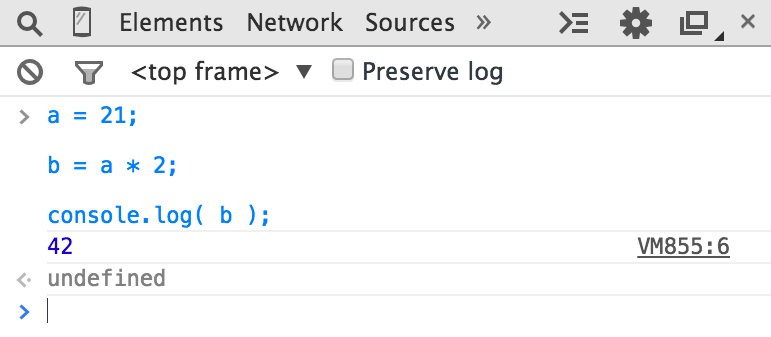
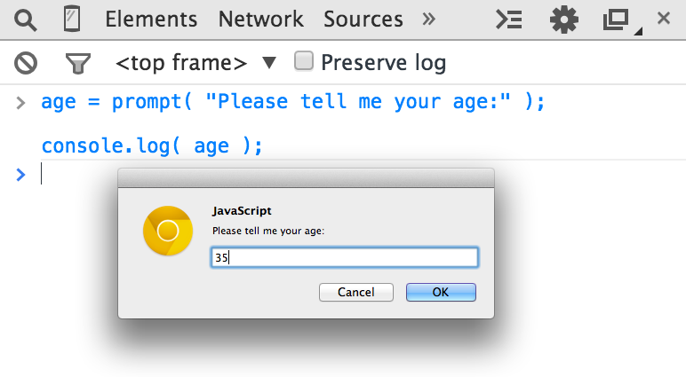
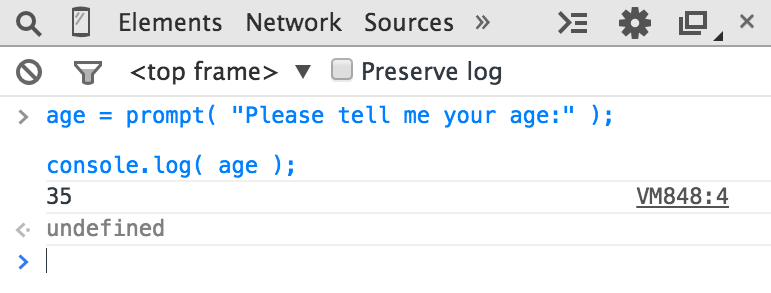

你不知道的JS：起步和入门
=====


第一章：开始编程
---

> 欢迎来到 *你不知道的JS* 系列  

这一章的主要内容是对编程对一些基本概念的介绍 —— 当然，我们主要学习JavaScript（通常缩写为：**JS**）—— 进而接触并且理解这个系列余下的章节。如果你正好是刚接触编程和JavaScript，这本书将为你之后需要学习和深入的知识点作简要的探讨。

&nbsp;  

这本书在较高的水平上解释编程的基本原理，主要是为了帮助先前没有编程经验，并且希望通过一些书籍来学习编程的你，用JavaScript来理解编程。

&nbsp;

第一章是作为对你想要了解和练习编程的快速预览。也有很多其他不错的编程介绍资源帮助你深入理解这些知识，建议你在了解本章后去学习它们。    

&nbsp;

一旦你理解了通用的编程基础，第二章将帮助你熟悉JavaScript的编程风格。第二章介绍了JavaScript是什么，但是，这并不是综合指南—— 因为接下来的都是这本书的主要内容。    

&nbsp;

如果你已经熟悉JavaScript，请直接跳到第三章，了解可以从这本书中收获什么。    

&nbsp;

## 代码

&nbsp;

开始吧！    

&nbsp;

程序，通常被称为源代码或者代码，是一组特殊的指令，来告诉计算机该执行什么任务。

&nbsp;  

代码通常被储存在文本文件中，但是使用JavaScript，你也可以直接在浏览器中将代码直接输入开发者控制台，稍后我们将介绍。   

&nbsp;   

有效格式和指令组合的规则称为计算机语言，有时它的 *语法* ，就跟英语差不多，告诉你如何拼写单词，并且使用单词和标点符号组成有效的句子。    

&nbsp;

## 语句

在计算机语言中，用来执行特定任务的字符，数字和操作符的组合，被称为语句，在JavaScript中，一个语句如下所示：

&nbsp;

```
a = b * 2;

```

&nbsp;

字符```a```和```b```被称为变量（参考 "Variables"),它们就像你可以储存任何东西的盒子一样。在程序里面，变量用来保存值（像数字类型```42```）供程序使用。你可以认为它们是值的象征性的占位符。    

&nbsp;

作为对比，```2```自身只是一个值，叫作 *字面量*，因为它只是作为单独存在并未保存在值当中。    

&nbsp;

``=`` 和 ``*`` 是操作符（参考 *Operators*) —— 他们同值和变量一起执行动作，比如赋值和数学运算。    

&nbsp;  

JavaScript里大部分声明的最后都包括一个分号```;```    

&nbsp;

``a = b * 2`` 这行语句大致上告诉计算机，将当前的值存在变量``b``里面，将这个值乘以``2``,然后将返回的值保存在另一个我们称为``a``的变量里。    

&nbsp;  

**程序** 只是很多这样的语句的集合，它们一起被用来描述执行程序目的所需的所有步骤。    

&nbsp;   

## 表达式

&nbsp;

语句由一个或多个表达式组成。一个表达式是对任意变量或值的引用，或者一组由操作符组合的变量和值。    

&nbsp;

比如：    

&nbsp;

```
a = b * 2;

```

&nbsp;

这行语句包括4个表达式：    

&nbsp;

+ ``2``是 *字面量表达式*   

&nbsp;   

+ ``b`` 是 *变量表达式*，检索其当前保存的值    

&nbsp;   
+ ``b * 2`` 是 *算术表达式* ，用来执行乘法运算

&nbsp;   

+ ``a = b * 2`` 是 *声明表达式*，用来将``b*2``表达式得到的结果赋值给变量``a``（之后还会更多提及声明）  

&nbsp;  

独立的一般表达式也被称为*表达式语句*,如下所示：    

&nbsp;

```js
b * 2；

```

&nbsp;

这种风格的表达式语句不是很常见或者有用，一般的说，它对程序的运行没有任何影响 —— 这行语句检索``b``的值并且乘以``2``,然后并没有对结果进行处理。    

&nbsp;

一个更常见的表达式语句是 *调用表达式语句*（参考 "Functions"），因为整条语句是函数调用表达式本身：    

&nbsp;

```js

alert( a );

```

&nbsp;

## 执行程序

&nbsp;

程序语句的集合是怎样告诉计算机做什么的呢？程序需要被执行，也被称为 *运行程序*      

&nbsp;

语句诸如``a = b * 2`` 对于开发者读写的时候是有用的，但是这种形式对于计算机来说不好理解。所以计算机上的一个特殊单元（解释器或者编译器）被用来将你写的代码转换成计算机可以理解的命令。    

&nbsp;

对于某些计算机语言，每次程序运行时，这种自上到下，逐行翻译的命令，被称为``解释``代码。    

&nbsp;

对于另外一些语言，翻译是提前完成的，被称为``编译``代码，所以当程序``运行``之后，实际上运行的是已经编译好的计算机指令。    

&nbsp;

通常来讲``JavaScript``是``解释``型的，因为你的JavaScript源码是每次执行的时候被处理的。但是，这并不完全准确。Javascript引擎实际上是即时编译程序然后立即执行编译后的代码。    

&nbsp;

注：如果想更多的了解JavaScript的编译，查看本系列的 *作用域和闭包* 的前两章。    

&nbsp;

## 个人练习

本章节将通过单一的代码片段介绍每个编程概念，所有代码都是用JavaScript编写（明显的！！）    

&nbsp;

需要再次强调的是：当你学习这一章后 - 你可能需要花费时间再复习几遍 - 通过自己键入代码练习这些概念。 最简单的方法是在常用的浏览器（Firefox，Chrome，IE等）中打开开发者工具控制台。    

&nbsp;

提示：通常，你可以使用键盘快捷方式或从菜单项启动开发者控制台。 有关在你喜欢使用的浏览器中启动和使用控制台的更多详细信息，请参阅“掌握开发人员工具控制台”(http://blog.teamtreehouse.com/mastering-developer-tools-console)[http://blog.teamtreehouse.com/mastering-developer-tools-console]。

&nbsp;  

要一次在控制台中输入多行，请使用``<shift> ``+ ``<enter>``移至下一行。 一旦你单击``<enter>``，控制台就会运行你刚刚输入的所有东西。   

&nbsp;  

让我们熟悉在控制台中运行代码的过程。首先，我建议你在浏览器中打开一个空标签页。我更喜欢通过在地址栏中输入 ``about：blank`` 来做到这一点。 然后，确定你的开发者控制台是开着的，正如我们刚才提到的。    

&nbsp;

现在，敲下如下代码并且看运行结果：    


```js
a = 21;

b = a * 2;

console.log( b );

```

&nbsp;
在Chrome中的控制台中输入前面的代码应该产生如下所示的内容：



&nbsp;
继续尝试，学习编程最好的方式就是开始写代码。    

&nbsp;
## 输出

&nbsp;
在前面的代码片段中，我们使用了``console.log（..）``.简要的说，我们来看看这行代码是什么。    

&nbsp;

您可能已经猜到了，但这正是我们如何在开发者控制台中打印文本（也就是``输出``给用户）。 该声明有两个特点，我们应该解释一下。    

&nbsp;

首先，将``log（b）``部分称为函数调用（参考"Functions"）。 我们将变量``b``交给函数处理，该函数告诉它获取``b``的值并将其在控制台打印出来。    

&nbsp;

其次，``console.``是``log（..）``函数所在的对象引用。 我们会在第2章中更详细地介绍了对象及其属性。    

&nbsp;

另一种创建输出的方法是运行``alert（..）``语句。 例如:
```
alert( b )
```

&nbsp;

如果你运行它，你会注意到，对比将输出在控制台打印出来，不同的是，它显示了一个包含变量b内容的带有“OK”的弹出框。然而，从编码和运行程序的方面来说，使用``console.log（..）``比起使用 ``alert()`` 通常会更方便，，因为你可以一次性输出许多值而不中断浏览器界面。    

&nbsp;

在这本书里，我们会使用``console.log(..)``用来输出。    

&nbsp;

## 输入

&nbsp;

当我们在讨论输出的时候，你可能在想输入是怎样的（即从用户接收信息）     

&nbsp;

最常见的方式是HTML页面向用户展示可输入的表单元素（如文本框），然后使用JS将这些值读取到程序的变量中。    

&nbsp;

但是，为了使得学习和演示起来更容易，你可以使用相对简便的方法，例如本书展示的，使用``prompt（..）``功能：    

&nbsp;

```js
age = prompt( "Please tell me your age:" );

console.log( age );

```

&nbsp;

你可能已经猜到了，你传入给``prompt（..）``的信息 - 就是这个，"Please tell me your age" - 会在弹出窗口中打印出来。    

&nbsp;

看起来如下所示：    

&nbsp;



&nbsp;

通过点击 "OK" 提交输入文本后，你会发现你输入的值已经储存在变量``age``中，然后我们将用``console.log（..）``输出：    

&nbsp;

  

&nbsp;

为了在我们学习基本的编程概念的过程中使学习的事物保持简单，本书中的示例不需要输入。但是现在你已经看到如何使用``prompt（..）``，如果你想挑战自己，你可以尝试在你的探索实例中使用输入。

&nbsp;  

## 运算符

&nbsp;

运算符是我们在变量和值上面执行的操作。我们已经见过两个JavaScript运算符，``=``和``*``

&nbsp;

``*``运算符操作乘法运算，够简单了，对吧？

&nbsp;

``=``相等运算符被用来赋值 -- 我们首先在``=``右侧对原值进行计算,然后将得到对结果存入在左侧我们已经定义好对变量当中（目标变量）。

&nbsp;

提醒：对于赋值来说这种相反对顺序看起来很奇怪。相对于``a = 42``，有些人更倾向于原值在左侧，目标变量在右侧这种顺序，例如``42 -> a``(这不是有效的JavaScript！)。不幸的是，``a = 42``这种顺序的形式，和类似的变体，在现代编程语言中是相当普遍的。如果感觉不适应，只需花一些时间在脑子里练习这种顺序，以习惯它。

&nbsp;

思考：

&nbsp;

```
a = 2;

b = a + 1;

```

&nbsp;

在这里，我们将值``2``赋给变量``a``，然后，我们取到了变量``a``（仍然为``2``）的值，增加``1``后结果值变为``3``，然后将值存入变量``b``中。

&nbsp;

虽然不是技术意义上的运算符，你会在每个程序里使用关键字``var``，因为这是你声明（或者说 *创建*）变量的主要方式(参考："Variables")。

&nbsp;

在使用变量之前，你应该始终按名称声明变量。但是你只需要为作用域内的一个变量声明一次就可以了（参考"Scope"）；它可以根据需要被多次使用。例如：

&nbsp;

```js
var a = 20;

a = a + 1;
a = a * 2;

console.log( a ) //42

```

&nbsp;

JavaScript常用的运算符有以下这些：

&nbsp;

+ 赋值：``=``，例如``a = 2``

&nbsp;

+ 算术：``+``（加法），``-``（减法），``*``（乘法），``/``（除法），例如``a * 3``。

&nbsp;

+ 复合赋值：``+=``，``-=``，``*=``以及``/=``是将赋值与算术运算结合的复合运算符，例如``a += 1``（等同于``a = a + 2``）。

&nbsp;

+ 递增/递减：``++``（递增），``--``（递减），例如``a++``（等同于``a = a + 1``）。

&nbsp;

+ 对象属性访问：``.``，例如``console.log()``。    
**对象** 是属性（在特定命名的位置保存值）的集合。``obj.a``表示名为``obj``的对象值包含一个称为``a``的属性。属性也能以``obj["a"]``的形式访问。参考第二章

&nbsp;

+ 等于：``==``（宽容相等），``===``（严格相等）,``!=``（宽容不想等），``!==``（严格不想等），例如``a == b``。

&nbsp;

+ 比较：``<``（小于），``>``（大于），``<=``（小于或等于），``>=``（大于或等于），例如``a <= b``。

&nbsp;

+ 逻辑运算符：``&&``（和），``||``（或），例如``a || b``便是选择``a``或者``b``。    
这些运算符被用来表示复合条件（参考"Conditionals"），比如无论是``a``或者``b``都返回结果为true。

&nbsp;

注：有关更多详细信息，以及未提及的关于运算符的信息，请参阅Mozilla开发人员网络（MDN）的"Expressions and Operators"([https://developer.mozilla.org/zh-CN/docs/Web/JavaScript/Guide/Expressions_and_Operators](https://developer.mozilla.org/zh-CN/docs/Web/JavaScript/Guide/Expressions_and_Operators))。

&nbsp;

## 值和类型

&nbsp;

如果你问一个手机店的店员，一部手机多少钱，，他们说“99，99”（即99.99块），他们给你一个具体的数字，告诉你需要付多少来买它（加税）。 如果你想买两部这样的手机，你可以很容易的心算一下，基本价格的两倍即199.98块。

&nbsp;

如果同一个店员给你看另一部类似的手机，但说它是“免费的”，他们不会告诉你数字是多少，而是另一种代表你预期成本的表述-“免费“。

&nbsp;

当你之后问这部手机是否有充电器，那回答就只会是“是”或者“否”。

&nbsp;

从相似的方面来说，当你在程序中表示值时，你会根据你将对其进行的操作，为这些值选择不同的表示方式。

值的这些不同表示在编程术语中被称为类型。每个这些所谓的原始值都有JavaScript内置的类型：

&nbsp;

+ 当你需要进行数学运算，你会需要``number``（数字）

&nbsp;

+ 当你需要在屏幕上打印一个值，你会需要``string``（字符）（一个或多个字符，单词，句子）。

&nbsp;

+ 当你需要在程序中进行判断，你会需要``boolean``(``true``或``false``)。

&nbsp;

直接包含在源代码中的值称为*字面量*。``string``字符串字面量被双引号“...”或单引号（'...'）包围 - 唯一的区别是风格偏好。``number``和``boolean``字面量直接按原本的形式就行。（即``42``,``true``）。

&nbsp;

思考：

&nbsp;

```js

"I am a string";
"I am also a string";

42;

true;
false;

```

&nbsp;

在``string``/``number``/``boolean``值类型之外，对于编程语言来说提供 *arrays*，*objects*，*functions* 等是很普遍的。我们将在本章和下一章中介绍更多关于值和类型的内容。

&nbsp;

## 类型转换

&nbsp;

如果你有一个数字需要在屏幕上打印出来，则需要将该值转换为``string``字符串，而在JavaScript中，此转换称为“强制转换”。 同样，如果有人在电商页面上输入一系列数字字符，这便是字符串``string``，但是如果你需要要使用该值进行数学运算，则需要将其强制转换为数字``number``。

&nbsp;

JavaScript在``类型``中提供了几种不同的强制转换方式。 例如：

&nbsp;

```js
var a = "42";
var b = Number( a );

console.log( a ); //"42"

console.log( b ); // 42

```

&nbsp;

使用``Number(..)``（内置函数）是将任何其他类型强制转换为``number`` 类型。相当直接。

&nbsp;

但是一个有争议的话题是，当你尝试比较两个不是相同类型的值时，会发生什么，这就需要``隐式``强制转换。

&nbsp;

当比较字符串“99.99”和数字"99.99"，大多数人会同意它们是相等的。但他们并不完全一样，对吧？这是相同值的不同表现形式，两种不同的 *类型*。 你可以说他们“宽容相等”，不是吗？

&nbsp;

为了在这些常见的情况下帮助你，JavaScript有时候会启动 *隐式* 强制将值转换成匹配的类型。

&nbsp;

所以如果使用 ``==``宽容相等运算符比较 ``"99.99" == 99.99``，JavaScript将把左边的``"99.99"``转换为``number``类型的``99.99``。 然后比较 ``99.99 == 99.99``,结果自然为``true``。

&nbsp;

虽然旨在帮助你，如果你没有花时间学习它的行为机制，隐式强制转换可能会给你造成相当的疑惑。大多数JS开发人员可能从没有接触深入过，所以普遍的感觉是隐式强制转换是令人疑惑的并且造成意外的程序错误，因此应该避免。有时甚至在语言设计中被称其为缺陷。

&nbsp;

然而，隐式强制转换是一种 *可以被了解* 的机制，而且应该被任何想要认真对待JavaScript编程的人了解。一旦你了解了其规则，它不仅不会令人疑惑，而且它实际上可以让你的程序更好！在这方面下功夫是值得的。

&nbsp;

注：有关强制转换的更多信息，请参考本部分的第2章和本系列的“类型与语法”部分的第4章。

&nbsp;

## 代码注释

&nbsp;

手机店的店员工可能会记下一些新发布的手机的功能或者她公司发布的新计划。这些笔记只适用于店员 - 它们不是为了客户准备的。不过，这些笔记通过记录她可以如何应对顾客的方式帮助她更好的完成工作。

&nbsp;

学习写代码的要点之一，便是你得明白代码不仅仅是给电脑看的。如果不是体量很大，对于开发者和编译器来说，代码都是一样多的。

&nbsp;

你的计算机只在意机器码，经过 *编译* 的由二进制0和1组成的序列。你可以编写几乎无数的程序，都包含相同的0和1序列。但是你选择怎样去编写程序，影响的是 - 不仅包括你，还有你的团队成员，甚至未来的你。

&nbsp;

你应该努力不仅仅是编写能正常工作的程序，而且还得是能经过检验的合理的程序。。 你可以在通过为变量选择好的命名（参考"Variables"）和函数（参考"Functions"）这些方面进行尝试。

&nbsp;

但另一个重要的部分就是代码注释。这些是您的程序中的一些文本，纯粹是为了向人们解释你的代码。解释器/编译器将始终忽略这些注释。

&nbsp;

关于如何书写包含良好注释的代码，有很多建议，我们不能真正定义绝对的普遍规则。但是一些经验和指南是非常有用的：

&nbsp;

+ 没有注释的代码是不完善的

&nbsp;

+ 太多的注释（例如每行都有），可能暗示编写代码经验不足。

&nbsp;

+ 注释应该解释 *为什么*,而不是 *是什么*。它们可以在疑惑的地方适当的解释 *怎么是这样*。

&nbsp;

在JavaScript中，可能有两种类型的注释：单行注释和多行注释。

&nbsp;

思考:

&nbsp;

```js
// This is a single-line comment

/* But this is
      a multiline
          comment.
*/


```

&nbsp;

如果在单行语句上或者在行末尾注释，使用``//``单行注释是适当的。 ``//``之后一直到行尾的所有内容都会被视为注释（由编译器忽略）。单行注释中可以显示的内容没有限制。

&nbsp;

思考：

```
var a = 42;    //42 is the meaning of life

```

&nbsp;

如果你需要在注释中写很多行，，那``/ * .. * /``多行注释是适当的。

&nbsp;

多行注释的用法如下：

```js
/* The following value is used because
   it has been shown that it answers
   every question in the universe. */
var a = 42;

```

&nbsp;

它也可以出现在一行的任何地方，甚至在一行的中间，只要以``*/``结束它。 例如：

&nbsp;

```js
var a = /* arbitrary value */ 42;

console.log( a );   //42

```
&nbsp;

唯一不能出现在多行注释中的是``*/``，因为这将被解释为结束注释。

&nbsp;

从开始编程学习开始，你就一定要养成写代码注释的习惯。在本章的其余部分，你将看到我是如何使用注释来解释代码的，所以在自己的实践中你最好也这样做。相信我，阅读你代码的人都将会感谢你！

&nbsp;

## 变量

&nbsp;

大多数有用的程序都需要在程序运行过程中，跟踪一个随之变化的值，它会随着程序预期任务的各种操作被调用。

&nbsp;

实现这一方式最简单的方式，是将一个值赋给符号容器，被称为 *变量*，之所以这么称呼是因为容器会根据需要随时间变化。

&nbsp;

在某些编程语言中，你可以声明一个变量（容器）来保存特定类型的值，例如``number``或``string``。``静态类型``，也称为``强类型``，通过防止意外的价值转换，通常被引用，作为保证程序正确性的一个好处。

&nbsp;

其他语言强调值而不是变量的类型。*弱类型*，也称为 *动态类型*，允许变量随时保存任意类型的值。通常，允许单个变量表示一个值，将其引用可以作为程序灵活性的好处，无论在该程序的逻辑流程中，值随时可能采用任意类型形式。

&nbsp;

JavaScript属于后者，*动态类型*，意味着变量可以保存任意 *类型* 的值，并且不受 *类型* 限制。

&nbsp;

如前所述，我们使用``var``语句声明一个变量 - 注意声明中没有其他 *类型* 的信息。思考一下以下这个简单的程序：

&nbsp;

```js

var amount = 99.99;

amount = amount * 2;

console.log( amount );		// 199.98

// convert `amount` to a string, and
// add "$" on the beginning

amount = "$" + String( amount );

console.log( amount );		// "$199.98"

```

&nbsp;

变量``amount``一开始保存着数字``99.99``，然后保存``amount * 2``返回``number``结果，也就是``198.98``。

&nbsp;

第一个``console.log(...)`` 命令必须 *隐式* 强制转换 ``number``类型的值为``string``类型，再将其打印出来。

&nbsp;

语句``amount =“$”+ String（amount）`` *显式* 强制转换``199.98``的值为``string``类型，并在开头添加一个``$``字符。 此时，``amount``现在保存``string``类型的值``$199.98``，所以第二个``console.log（..）``语句不需要做任何强制转换。

&nbsp;

JavaScript开发者将注意到使用变量``amout``,无论是使用``99.99``,``199.98``和``"$199.98"``每个值的灵活性。 静态类型语言爱好者宁可使用一个单独的变量，例如``amountStr``来保存最终``"199.98"``表示最终结果，因为它是不同的类型。

&nbsp;

无论哪种方式，你都会注意到，变量``amount``保存着会随程序进程而变化的值，这也说明了变量的主要用途：管理程序 *状态*。

&nbsp;

换句话讲，*状态* 在程序运行的时候跟踪值的变化。

&nbsp;

变量另一个通常的用法是集中设置值，更通用的叫法为 *常量*，当你声明一个赋值的变量并且随着程序运行，它的值 *不会改变*。

&nbsp;

通常是在程序代码的顶部，声明这些 *常量*，这样做可以方便你在需要改动值的时候，可以在集中一个地方改动。按照惯例，JavaScript中的常量通常是大写的形式，在多个单词之间用下划线``_``连接。

&nbsp;

示例如下：

&nbsp;

```js

var TAX_RATE = 0.08;	// 8% sales tax

var amount = 99.99;

amount = amount * 2;

amount = amount + (amount * TAX_RATE);

console.log( amount );				// 215.9784
console.log( amount.toFixed( 2 ) );	// "215.98"

```

&nbsp;

**注**：类似于``console.log（..)``是作为``console``值的对象属性访问函数``log（..）``，``toFixed（..）``在这里可以通过``number``访问到。 JavaScript中的``number``类型不会自动格式化为美元格式 - 引擎不知道你的意图是什么，并且没有货币的数据类型。 ``toFixed（..）``方法让我们指定想要四舍五入的小数位数，并根据需要生成``string``字符串。

&nbsp;

变量``TAX_RATE``按惯例来说只是 *常量* - 程序没有特殊的机制可以防止它被改变。但是，如果示例中城市的销售税率提高到9％，我们仍然可以通过将``TAX_RATE``设置为``0.09``来轻松的更新我们的程序，而不是找到程序中所有为``0.08``的值，并且更新它们。

&nbsp;

最新版本的JavaScript(通常称为“ES6”）,包含了一种新的方法来声明常量，通过使用``const``而不是``var``：

&nbsp;

```js

// as of ES6:
const TAX_RATE = 0.08;

var amount = 99.99;

// ..

```

&nbsp;

常量是很有用的，就像有固定值的变量一样，并且，在初始设置之后，常量还可以防止程序在某些地方意外的改变值。假如你尝试在初次声明之后将不同的值赋给``TAX_RATE``,你的程序将会阻止这种行为（在严格模式里，会出现报错 -- 参考第二章的“严格模式”）。

&nbsp;

顺带一提，这种防范错误的"保护"机制，类似于静态类型的类型强制，所以你应该知道了为什么其他语言的静态类型如此有吸引力！

&nbsp;

**注**：想了解更多关于如何在程序中使用变量的不同值的更多信息，请参阅本系列的“类型与语法”部分。

&nbsp;

## Blocks

&nbsp;

手机店店员在你买新手机时，必须经过一系列步骤才能完成结帐。

&nbsp;

类似的，在代码中我们经常需要组合一系列的语句，我们称其为``block``(代码块)，在JavaScript中，我们通过将一个或多个语句包裹在大括号``{..}``中来定义代码块，例如：

&nbsp;

```js
var amount = 99.99;

// a general block
{
	amount = amount * 2;
	console.log( amount );	// 199.98
}

```

&nbsp;

这种独立的``{..}``通用代码块是有效的，但在JS程序中并不常见。通常，代码块需要附加到某些控制语句中，例如``if``(条件)语句（参考"Conditions"）或``loop``(循环)（参考"Loops"）。例子：

&nbsp;

```js

var amount = 99.99;

// is amount big enough?
if (amount > 10) {			// <-- block attached to `if`
	amount = amount * 2;
	console.log( amount );	// 199.98
}

```

&nbsp;

我们将在下一个部分解释``if``条件语句，但是如你所见，带有两个语句的``{..}``代码块被附加到``if（amount> 10）``条件语句；这些在代码块里的语句只会在条件通过的情况下被执行。

&nbsp;

**注**：不像大部分其他的语句例如``console.log(amount);``，一个代码块并不需要以一个分号``;``结尾。

## 条件语句

“你想购买额外的屏幕贴膜吗，只要9.99块？”乐于助人的手机店员询问你的决定。你可能先得看看钱包的``状态``或者查询银行账户，再作出决定。但是明显的，这只是个"yes or no"的问题。

&nbsp;

我们的程序里只有为数不多的方式表示 *条件语句*（或者决定）。

&nbsp;

最常见的一个便是``if``语句。基本上，你可以这样表述，“如果此条件为真，那么……”。例子如下：

&nbsp;

```js
var bank_balance = 302.13;
var amount = 99.99;

if (amount < bank_balance) {
	console.log( "I want to buy this phone!" );
}

```
&nbsp;

``if``条件语句需要在小括号``( )``中填入表达式，其可以被视为表示``true``或``false``。在程序中，我们提供了表达式``amount < bank_balance``，我们根据变量``bank_balance``中的数量，判断结果是``true``或者``false``。

&nbsp;

如果条件不成立，你还可以提供替代的处理函数，称为``else``语句。例子如下：

&nbsp;

```js
const ACCESSORY_PRICE = 9.99;

var bank_balance = 302.13;
var amount = 99.99;

amount = amount * 2;

// can we afford the extra purchase?
if ( amount < bank_balance ) {
	console.log( "I'll take the accessory!" );
	amount = amount + ACCESSORY_PRICE;
}
// otherwise:
else {
	console.log( "No, thanks." );
}

```

&nbsp;

在这里，如果``amount < bank_balance``为``true``,我们将打印``"I'll take the accessory!"``，然后将变量``amount``与``9.99``相加。与此相反，``else``语句告诉我们将礼貌的回应``"No, hanks."``并且保持变量``amount``不变。

&nbsp;

如我们之前在“值和类型”中提到的，值若不是期望的数据类型，将会被强制转换为相应类型。``if``语句期望一个``boolean``（布尔值），但是你如果传入的值并非布尔值，那么就会进行强制转换。

&nbsp;

JavaScript定义了，被认为是“错误的”的特殊值的列表，因为当它们被强制转换成``boolean``时，它们会被判断成``false``--这些值包括``0``和``""``。没有在“错误”列表中的其他值自动为"正确"--当被转换为``boolean``值时，它们被判断为``true``。正确的值包括``99.99``和``"free"``等。可以查看第二章的“Truthy & Falsy”获取更多信息。

&nbsp;

除了``if``语句，*条件语句* 还有其他的形式。例如，``switch``语句可以用作一系列``if..else``语句的缩写（参考 第2章）。循环（参考“Loops”）语句使用 *条件语句* 来决定循环是否继续或中止。

&nbsp;

**注**：有关 *条件表达式* 中的隐式强制转换的更深入的信息，请参考本系列的“类型和语法”部分的第4章。

&nbsp;

## Loops

&nbsp;

在忙碌时段，店员会为需要询问店员的顾客会准备一份等候列表。当列表上仍然有人，她只需继续为下一位顾客提供服务。

&nbsp;

重复一组动作直到条件不成立 - 换句话讲，仅在条件成立时重复 -- 这便是程序循环的工作。循环可以采取不同的形式，但是它们都满足这种基本的行为。

&nbsp;

一个循环包括测试条件和代码块（常见为``{ .. }``)。每次循环代码块执行的时候，都称为“迭代”。

&nbsp;

例如，``while``循环和``do..while``循环，重复说明一个代码块语句的概念，直到一个条件不再判断为``true``：

&nbsp;

```js
while (numOfCustomers > 0) {
	console.log( "How may I help you?" );

	// help the customer...

	numOfCustomers = numOfCustomers - 1;
}

// versus:

do {
	console.log( "How may I help you?" );

	// help the customer...

	numOfCustomers = numOfCustomers - 1;
} while (numOfCustomers > 0);
```

&nbsp;

这两个循环之间唯一实际的区别，在于条件是否在初次迭代（``while``)之前测试，还是在初次迭代后（``do..while``)。

&nbsp;

每种形式中，如果条件测试结果为``false``，那么下一次迭代将不会执行，那么也意味着，如果条件初始化时为``false``，``while``循环将永远不会执行，但是``do..while`` 循环将只执行头一次。

&nbsp;

有时候，如果你想通过循环一组数字得到预期结果，例如从0到9（10个数字）。你可以通过设置一个循环迭代变量（如值为``0``的``i``），并且每次迭代递增``1``。

&nbsp;

**提醒：** 基于一些历史原因，编程语言几乎都是以零为基数来计算，即从``0``开始，而不是``1``。如果你习惯这种思维方式，在一开始的时候会相当疑惑。花些时间练习从``0``开始的计数来习惯吧！

&nbsp;

条件测试会在每次迭代执行，这看起来就像在循环中有一个隐藏的``if``条件语句。

&nbsp;

我们可以使用JavaScript中的``break``语句来中止循环。同样的，我们可以看出，没有``break``中断机制，创建一个永远执行的循环语句是非常容易的。

&nbsp;

演示：

&nbsp;

```js

var i = 0;

// a `while..true` loop would run forever, right?
while (true) {
	// stop the loop?
	if ((i <= 9) === false) {
		break;
	}

	console.log( i );
	i = i + 1;
}

// 0 1 2 3 4 5 6 7 8 9

```

&nbsp;

**提醒：** 对于你想应用的循环，这种形式是不必要的，以上的代码展示只是单纯的出于演示的目的。

&nbsp;

虽然``while``(或者 ``do..while``)能够手动的完成任务，另一种称为``for``循环的形式同样能达到目的：

&nbsp;

```js
for (var i = 0; i <= 9; i = i + 1) {
	console.log( i );
}
// 0 1 2 3 4 5 6 7 8 9
```

&nbsp;

如你所见，在这两种情况下，对于任一循环形式的前10次迭代（值为``0``到``9``的``i``），条件``i <= 9``为``true``，但一旦``i``的值为``10``，则变为``false``。

&nbsp;

``for``循环有3个部分，初始条件（``var i=0``)，条件测试部分（``i <= 9``）,以及更新部分（``i = i + 1``）。所以如果你打算用循环迭代做计算，``for``循环对于理解和编写方面，都是更简洁和简易的形式。

&nbsp;

还有其他特殊的循环形式用来迭代特定的值，例如对象中的属性（参考 第2章），隐藏条件只是用来测试所有的属性是否都已经处理。“循环直到条件不成立”这一概念对于任意循环的形式都是适用的。

&nbsp;

## 函数

&nbsp;

手机店员可能不会随身携带计算器来计算税和最终的购买价格。她需要一个任务，只需定义一次，就可以重复利用。奇怪的是，公司有一个内建了这些“函数”的计算器（电脑，平板等）。

&nbsp;

类似的，你的程序当然也想代码任务分割成可重复利用的模块，而不是反复的重复你自己（双关语嘻嘻），实现这个的方式就是定义一个``函数``。

一个函数通常是可以通过名字被“调用”的被命名的代码块，而且里面的代码每次会被执行。如下所示：

&nbsp;

```js
function printAmount() {
	console.log( amount.toFixed( 2 ) );
}

var amount = 99.99;

printAmount(); // "99.99"

amount = amount * 2;

printAmount(); // "199.98"

```

&nbsp;

函数可以选择性的使用参数--你传入的值。而且它们还可以选择回传值。

&nbsp;

```js

function printAmount(amt) {
	console.log( amt.toFixed( 2 ) );
}

function formatAmount() {
	return "$" + amount.toFixed( 2 );
}

var amount = 99.99;

printAmount( amount * 2 );		// "199.98"

amount = formatAmount();
console.log( amount );			// "$99.99"

```

&nbsp;

函数``printAmount()``使用了一个名为``amt``的参数，函数``formatAmount``返回了一个值。当然，你可以在同一个函数里结合这两个功能。

&nbsp;

函数常见的使用方式，是用于需要多次调用的代码，但是也同样适用于将相关联的代码组织在一个命名集合里，就算你只打算调用一次。

&nbsp;

看如下示例：

&nbsp;

```js
const TAX_RATE = 0.08;

function calculateFinalPurchaseAmount(amt) {
	// calculate the new amount with the tax
	amt = amt + (amt * TAX_RATE);

	// return the new amount
	return amt;
}

var amount = 99.99;

amount = calculateFinalPurchaseAmount( amount );

console.log( amount.toFixed( 2 ) );		// "107.99"

```

&nbsp;

尽管`calculateFinalPurchaseAmount(..)`函数只调用一次，但是将其行为组织到单独命名到函数，可以让代码逻辑（`amount = calculateFinal...` ）更清晰。如果函数里的语句更多，那么这样做的优势也会更加突显出来。

&nbsp;

## 作用域

如果你向手机店员询问她的店里没有的手机型号，她便不会卖给你。她只有卖她店里有的手机的权限。你必须到别的店里去看看你想要的手机型号。

&nbsp;

编程里有一个描述这个概念的术语：*作用域* （技术上称为 *词法作用域*）。在JavaScript中，每个函数都有其作用域。作用域基本上是变量以及这些变量可以如何通过名字被访问的规则的集合。只有函数里的代码可以访问函数 *作用域* 内的变量。

&nbsp;

同一个作用域内的变量名字必须是独一无二的 -- 不可能有两个不同的变量``a``同时坐在彼此面前。但是名字同为``a``的变量可以存在不同作用域内。

&nbsp;

```js

function one() {
	// this `a` only belongs to the `one()` function
	var a = 1;
	console.log( a );
}

function two() {
	// this `a` only belongs to the `two()` function
	var a = 2;
	console.log( a );
}

one();		// 1
two();		// 2


```

&nbsp;

同样的，一个作用域可以存在于另一个作用域里面，就像一个小丑可以在生日派对上表演在一个气球里再吹一个气球（什么比喻啊！）。如果一个作用域存在于另一个作用域中，最底层作用域中的代码可以访问每个作用域的变量。

 &nbsp;

 例子：

 &nbsp;

 ```js

 function outer() {
 	var a = 1;

 	function inner() {
 		var b = 2;

 		// we can access both `a` and `b` here
 		console.log( a + b );	// 3
 	}

 	inner();

 	// we can only access `a` here
 	console.log( a );			// 1
 }

 outer();

 ```

&nbsp;

词法作用域的规则中提到，一个作用域中的代码可以访问任意其外层作用域中的变量。（作用域链）。

&nbsp;

所以，``inner``函数中的代码可以访问变量``a``和``b``,但是``outer`` 函数只能访问``a`` -- 其不能的访问``b``是因为变量只存在 ``inner()``作用域中。

&nbsp;

再次调用之前写的代码片段：

&nbsp;

```js

const TAX_RATE = 0.08;

function calculateFinalPurchaseAmount(amt) {
	// calculate the new amount with the tax
	amt = amt + (amt * TAX_RATE);

	// return the new amount
	return amt;
}


```

&nbsp;

常量```TAX_RATE```可以在`calculateFinalPurchaseAmount( .. )`函数内部访问到，即使我们并没有将其传进去，就是因为词法作用域的原因。

&nbsp;

## 练习

&nbsp;

学习编程除了练习绝对没有捷径可言。本部分也没有一定数量清晰的内容可以令你单独凭借其成为一名编程人员。

&nbsp;

记住这一点，让我们练习本章中学习到的一些概念，我会给出“要求”，然后你先尝试，再参考本章最后的参考代码，看我是如何解决的。

&nbsp;

+ 写一个计算手机价格的程序，你将持续购买手机（提示：循环）直到你的银行账户中没有余额。你还会为你的手机购买配件，如果配件价格低于你的心理预期价格。

&nbsp;

+ 在你计算出购买价格后，加上税金，然后打印出计算后的购买金额，格式要正确。

&nbsp;

+ 最后，将金额与银行账户余额对比，看你是否能负担的起。

&nbsp;

+ 你应该设置一些常量，包括“税率”，“手机价格”，“配件价格”，和“支付底限”，以及“银行账户余额”的变量。

&nbsp;

+ 你应该定义一个函数用来计算税金，和用“$”符号格式化价格，并且价格保留小数点后两位。

&nbsp;

+ **额外挑战：** 试着在程序中加入输入功能，可以使用之前在“输入”部分提及的``prompt``。比如，你可以询问用户输入他们的账户余额。玩的开心，发挥你的创意吧！

&nbsp;

加油，尝试，不要偷看参考答案，除非你放弃挑战自己！

&nbsp;

**注：** 因为这本书是关于JavaScript的，所以我也是用JavaScript来解决问题。但是你也可以用其他的语言，如果你觉得这更适合你的话。

&nbsp;

解决方案如下：

&nbsp;

```js
const SPENDING_THRESHOLD = 200;
const TAX_RATE = 0.08;
const PHONE_PRICE = 99.99;
const ACCESSORY_PRICE = 9.99;

var bank_balance = 303.91;
var amount = 0;

function calculateTax(amount) {
	return amount * TAX_RATE;
}

function formatAmount(amount) {
	return "$" + amount.toFixed( 2 );
}

// keep buying phones while you still have money
while (amount < bank_balance) {
	// buy a new phone!
	amount = amount + PHONE_PRICE;

	// can we afford the accessory?
	if (amount < SPENDING_THRESHOLD) {
		amount = amount + ACCESSORY_PRICE;
	}
}

// don't forget to pay the government, too
amount = amount + calculateTax( amount );

console.log(
	"Your purchase: " + formatAmount( amount )
);
// Your purchase: $334.76

// can you actually afford this purchase?
if (amount > bank_balance) {
	console.log(
		"You can't afford this purchase. :("
	);
}
// You can't afford this purchase. :(


```

**注：** 运行这个JavaScript程序最直接的方式就是在浏览器的控制台中运行它。

&nbsp;

你是怎么解决的呢？看过答案之后也无碍你再一次尝试。你可以改变一些常量来看看程序是如何根据不同的值运行的。

&nbsp;

## 复习

&nbsp;

学习编程的过程不一定是复杂和充满压力的。你只需要在你脑中形成一些基本的概念。

&nbsp;

这些步骤就像砌砖块（搬砖）。为了建一座高塔，你首先得将砖块一块块叠加。程序也是同理。以下是一些基本的编程建材：

&nbsp;

+ 你需要 *运算符* 去操作值。

&nbsp;

+ 你需要值和 *类型* 去执行不同类型的操作，像``number``的数学运算和``string``的输出。

&nbsp;

+ 在你的程序执行过程中你需要 *变量* 用来保存数据（即 *状态* ）

&nbsp;

+ 你需要 *条件语句* 像 ``if`` 语句来进行条件判断。

&nbsp;

+ 你需要 *循环* 重复任务直到条件不再为 ``true``。

&nbsp;

+ 你需要用 *函数* 将代码组织成逻辑清楚和可复用的功能模块。

&nbsp;

代码注释是书写具有良好阅读性代码的有效方式，当你的程序出了问题，它可以使得你的程序更容易被理解，维护和修复。

&nbsp;

最后，不要忽视练习的重要性。学习写代码最好的方式就是开始写代码。

&nbsp;

我很高兴你正在学习如何编写代码！一定要坚持。不要忘了看看别的入门学习资源（书、博客、在线课程等等）。本章和本书是个良好的开始，但是这只是个简单的介绍。

&nbsp;

下一章将复习本章的一些概念，但不同的是，会从JavaScript中更具体的角度阐述，这些会在本系列中的其他部分进行更详细的讨论。

&nbsp;
